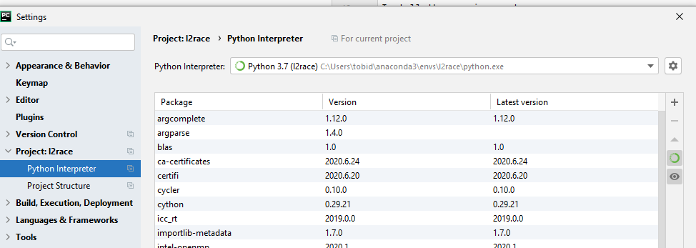
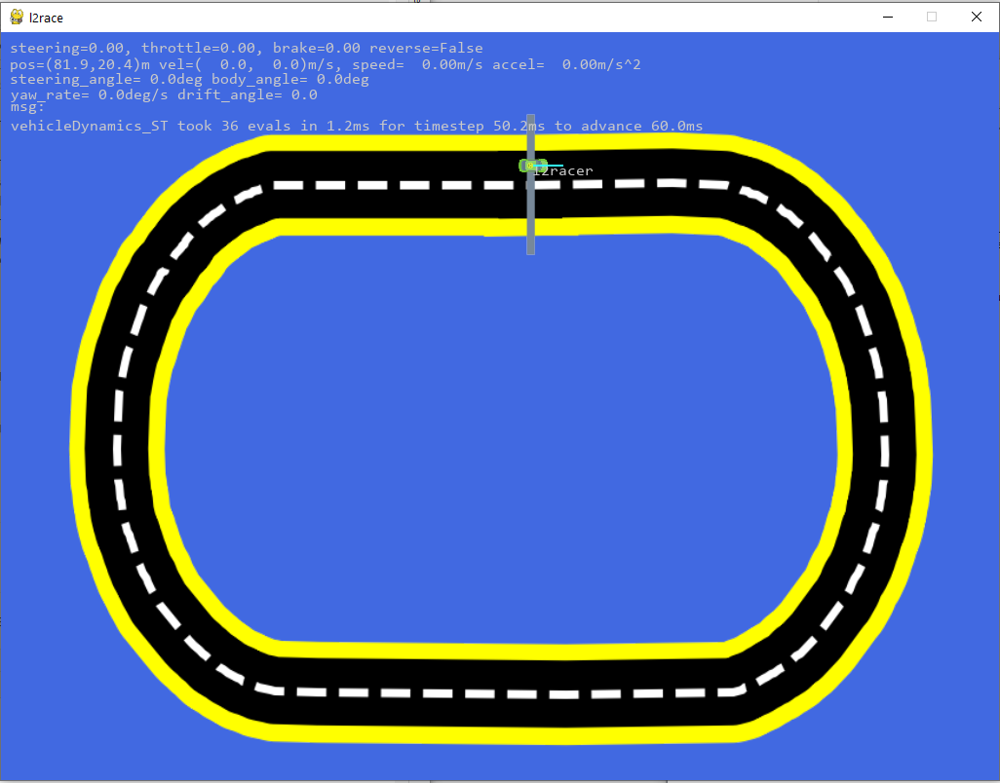

# Learning to Race (l2race)
 
Simulation of racecar from eye of god view. User algorithms must learn from only real time data to drive the car as quickly as possible around the track. Data can be collected by human driving or by developing a basic controller and using it to bootstrap more powerful controllers.

The key aims are to learn a controller from limited 'real world' data and to use it for optimal control.


 - [L2RACE challenge page](https://sites.google.com/view/telluride2020/challenges/l2race?authuser=0) on workshop site
 - The [L2RACE google driver folder](https://drive.google.com/drive/folders/1IJmfvKY2n24PQTGxc9Ek4ApufMVISC1C?usp=sharing).
 - In particular, [L2RACE introductory slides](https://docs.google.com/presentation/d/1nvmZqHNQrUKONi_r6YIpepk4Ie-LkIc1N1GxrF_Ehv0/edit?usp=sharing).
 

## Requirements

 - Windows, linux, macOS all seem to work
 - anaconda or miniconda https://www.anaconda.com/products/individual
 - Use Python 3.7.x (for pygame 2.0, using prebuilt python wheel archive)
 - We use pycharm for development, which includes some useful launchers to start local server, client, client to our remote model server. https://www.jetbrains.com/pycharm/download . You can use the community edition.


## Setup
Conda is your friend! Make a new environment called l2race to work in l2race and do everything in that environment!

You can try to build the entire conda env l2race using

```shell script
conda env create -f environment.yml
```

If this does not work for some reason (some libraries are still not available from conda repos), then you can also use pip to install the requirements into your conda environment.
Make a new environment (see https://docs.conda.io/projects/conda/en/latest/user-guide/tasks/manage-environments.html#). 

First, install miniconda or conda, then make an empty python 3.7 environment:
```shell script
conda create --name l2race python=3.7
```
Activate it:
```shell script
conda activate l2race
```
You can install the requirements in this environment using its own pip.
 Make sure you are using the conda pip in your conda environment:
```shell script
where pip
C:\Users\tobid\anaconda3\envs\l2race\Scripts\pip.exe
```
Install the requiremepnts:

```shell script
pip install -r requirements.txt
``` 
#### pygame
The necessary pygame 2.0 seems to install into windows and linux and macOS directly with pip now.

If you still have problems, you can see the pygame 2.0-dev10 (needed for python 3.7) wheels at https://www.piwheels.org/project/pygame/ or https://github.com/pygame/pygame/releases.  (A _wheel_ is a kind of archi8ve of python stuff with all dependencies; they are named according to the platform and OS). Then use pip install wheel-file. Download the wheel for pygame 2.0 for python 3.7 and your OS.


#### requirements.txt notes
_requirements.txt_ was built automatically using https://stackoverflow.com/questions/31684375/automatically-create-requirements-txt
```shell script
pip install pipreqs
pipreqs --force .
```

## pycharm
You should be able to open l2race project from pycharm directly, since l2race includes the jetbrains/pycharm .idea folder.
Once in pycharm, if you have already setup the l2race conda environment, then pycharm should find it. If not, set up the conda enviroment in pycharm using Project settings/Project interpreter and point to your l2race conda environment:



# Running l2race

l2race uses client-server. 

The client draws the racetrack and car and accepts input from keyboard or xbox joystick controller or your software agent.

The server computes the car dynamics model in response to your command input and returns the car state to the client.

From root of l2race, start the server and client from separate terminals (or from pycharm; see below).

### start client

The command 
```tags
python -m main --host=telluridevm.iniforum.ch
```
will start the client (your view of track with your car) running on the server we setup for the workshop called _telluridevm.iniforum.ch_. It is a powerful 16-core machine with plenty of CPU for running the complex car models.

Here is a run example:
```shell script
(l2race) F:\tobi\Dropbox (Personal)\GitHub\neuromorphs\l2race>python -m main --host=telluridevm.iniforum.ch
pygame 2.0.0.dev10 (SDL 2.0.12, python 3.7.7)
Hello from the pygame community. https://www.pygame.org/contribute.html
2020-08-09 19:07:28,967 - commonroad.vehicleDynamics_MB - WARNING - check_cython: F:\tobi\Dropbox (Personal)\GitHub\neuromorphs\l2race\commonroad\vehicleDynamics_MB.py is still just a slowly interpreted script. (vehicleDynamics_MB.py:21)
2020-08-09 19:07:29,142 - src.client - WARNING - Gooey GUI builder not available, will use command line arguments.
Install with "pip install Gooey". See README (client.py:63)
2020-08-09 19:07:29,143 - src.client - WARNING - Gooey GUI not available, using command line arguments. 
You can try to install with "pip install Gooey".
Ignore this warning if you do not want a GUI. (client.py:71)
2020-08-09 19:07:29,283 - src.client - INFO - using pygame version 2.0.0.dev10 (client.py:92)
2020-08-09 19:07:29,328 - src.my_joystick - INFO - joystick named "Xbox One S Controller" found with 6 axes and 11 buttons (my_joystick.py:66)
Joystick commands:
steer with left joystick left|right
throttle is right paddle, brake is left paddle
B toggles reverse gear
Y toggles automatic control (if implemented)
Menu button resets car
X R restarts client from scratch (if server went down)
Windows button quits

2020-08-09 19:07:31,335 - src.client - WARNING - Caught exception No IGD found. when trying to open l2race client ports (client.py:249)
.....
```
You can ignore the "No IGD found". It means that upnp library (http://miniupnp.free.fr/) could not find an Internet Gateway Domain plug and play manager to open port. If you are using the remote server or a local server, the clienht should start running and you should see something like this:



You can ignore any warnings about gooey and IGD. (Gooey is a GUI launcher. If you have gooey installed, it will start the client with a GUI that is prepopulated with defaults and your command line options. But it is not necessary. IGD is a tool that attempts to open necessary ports for l2race via UPnP. Usually you don't need to open these ports now.)

### Start the server

If you want to run the server on your local machine, do it like this:

```shell script
(l2race) F:\tobi\Dropbox (Personal)\GitHub\neuromorphs\l2race>python -m server
pygame 2.0.0.dev10 (SDL 2.0.12, python 3.7.7)
Hello from the pygame community. https://www.pygame.org/contribute.html
WARNING:commonroad.vehicleDynamics_MB:check_cython: F:\tobi\Dropbox (Personal)\GitHub\neuromorphs\l2race\commonroad\vehicleDynamics_MB.py is still just a slowly interpreted script.
WARNING:__main__:Gooey GUI builder not available, will use command line arguments.
Install with "pip install Gooey". See README
WARNING:__main__:Gooey GUI not available, using command line arguments.
You can try to install with "pip install Gooey"
```

Don't worry about missing Gooey; install it if you want to have a GUI pop up to launch the  server.


## client options
````shell script
"C:\Program Files\JetBrains\PyCharm 2020.1.4\bin\runnerw64.exe" C:\Users\tobid\anaconda3\envs\l2race\python.exe "F:/tobi/Dropbox (Personal)/GitHub/neuromorphs/l2race/main.py" -h
pygame 2.0.0.dev10 (SDL 2.0.12, python 3.7.7)
Hello from the pygame community. https://www.pygame.org/contribute.html
2020-08-09 19:19:49,236 - commonroad.vehicleDynamics_MB - WARNING - check_cython: F:\tobi\Dropbox (Personal)\GitHub\neuromorphs\l2race\commonroad\vehicleDynamics_MB.py is still just a slowly interpreted script. (vehicleDynamics_MB.py:21)
usage: main.py [-h] [--host HOST] [--port PORT] [--timeout_s TIMEOUT_S]
               [--fps FPS] [--joystick JOYSTICK] [--record]
               [--track_name TRACK_NAME] [--car_name CAR_NAME] [--spectate]
               [--log LOG]

l2race client: run this if you are a racer.

optional arguments:
  -h, --help            show this help message and exit
  --log LOG             Set logging level. From most to least verbose, choices
                        are "DEBUG", "INFO", "WARNING". (default: INFO)

Server options::
  --host HOST           IP address or DNS name of model server. (default:
                        localhost)
  --port PORT           Server port address for initiating connections.
                        (default: 50000)
  --timeout_s TIMEOUT_S
                        Socket timeout in seconds for communication with model
                        server. (default: 1)

Interface arguments::
  --fps FPS             Frame rate on client side (server always sets time to
                        real time). (default: 30)
  --joystick JOYSTICK   Desired joystick number, starting with 0. (default: 0)

Output options::
  --record              record data to date-stamped filename, e.g. --record
                        will write datestamped files named 'l2race-XXX.csv' in
                        folder 'data, where XXX is a date/timestamp'.
                        (default: False)

Track car/spectate options::
  --track_name TRACK_NAME
                        Name of track. Available tracks are in the
                        'media/tracks' folder. Available tracks are ['oval',
                        'oval_easy', 'Sebri', 'track_1', 'track_2', 'track_3',
                        'track_4', 'track_5', 'track_6'] (default: oval_easy)
  --car_name CAR_NAME   Name of this car (last 2 letters are randomly chosen
                        each time). (default: tobi-joule-amd:tobid-XC)
  --spectate            Just be a spectator on the cars on the track.
                        (default: False)

Run with no arguments to open dialog for server IP

````

### joystick and keyboard
 - Help for each device is printed on startup. For keyboard, you can type h anytime to see the keys help in console.
 - You need to focus on the pygame window for either input to work.

# Development

## pycharm

l2race includes pycharm _.idea_ files that have many useful run configurations already set up.

# Recording data

The _--record_ option automatically records a .csv file with timestamped filename to the _data_ folder. This file has the time, commnands, and car state.
